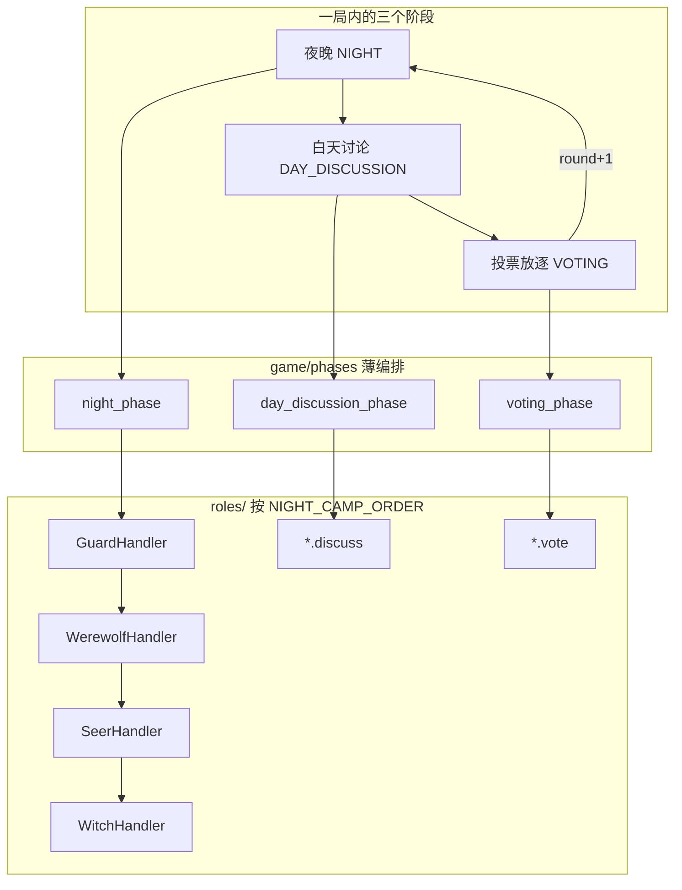

# Agent-Werewolf 项目结构说明

AI 驱动的狼人杀自动对局：每个玩家由大模型扮演，通过「游戏引擎 → 角色处理器 → 记忆系统 → LLM」协作完成一整局。

---

## 0. 概念分层（请先读这里）

### 游戏只有三个阶段（`Phase` 枚举）

| 阶段 | 枚举值 | 做什么 |
|------|--------|--------|
| **夜晚** | `NIGHT` | 各身份在夜里执行自己的行动（见下表） |
| **白天讨论** | `DAY_DISCUSSION` | 公布昨夜死讯 → 存活玩家依次发言 |
| **投票放逐** | `VOTING` | 投票、计票、放逐（或平票） |

另有终局状态 `GAME_OVER`，不算常规阶段。

一轮完整流程：**夜晚 → 白天讨论 → 投票放逐** → `round += 1` → 再回到夜晚。

### 角色处理器（`roles/`）

每个身份对应一个 **RoleHandler**（角色处理器）：封装该身份在各阶段的**标准流程**，由引擎在适当时机调用。

| 身份 | Handler 类 | 夜晚 `run_night_camp` 流程 | 白天 / 投票 |
|------|------------|---------------------------|-------------|
| 守卫 | `GuardHandler` | 选守护目标 → `guard_protect`（**狼刀前**，不知刀口） | 基类 `discuss` / `vote` |
| 狼人 | `WerewolfHandler` | ① 狼队频道沟通 → ② 解析协商刀口 → ③ 结构化刀人 → ④ 写入 `wolf_kill` | 同上 |
| 预言家 | `SeerHandler` | 查验 → `seer_check` + 私密消息 | 同上 |
| 女巫 | `WitchHandler` | 读刀口 → 决定解药/毒药 → `witch_save` / `witch_poison` | 同上 |
| 猎人 | `HunterHandler` | 无（空实现） | 同上；死亡时 `resolve_shoots_for_deaths` |
| 村民 | `VillagerHandler` | 无（空实现） | 同上 |

**夜晚阵营执行顺序**（`registry.NIGHT_CAMP_ORDER`）：**守卫 → 狼人 → 预言家 → 女巫**。

**12 人标准板子**（`game/setup.py`）：4 狼 + 4 神（预/女/猎/守）+ 4 村民，座位 1~12 随机洗牌。

> **命名说明**：此处用 **Handler（处理器）**，避免与 Cursor IDE 的 **Agent Skill**（`.cursor/skills/` 里的开发助手说明）混淆。

狼人 / 预言家 / 女巫等**不是**第四个游戏 Phase，而是 **夜晚阶段内部**、按身份触发的子流程：

| 角色活动 | 发生阶段 | 代码位置 | 写入 `night_actions` |
|----------|----------|----------|----------------------|
| 守卫守护 | 夜晚（狼刀前） | `roles/guard.py` + `llm/night.py` | `guard_protect` |
| 狼队频道协商 | 夜晚 | `roles/werewolf.py` + `llm/speech.py` | （进 werewolf 记忆） |
| 狼人刀人 | 夜晚 | `roles/werewolf.py` + `llm/night.py` | `wolf_kill` |
| 预言家查验 | 夜晚 | `roles/seer.py` + `llm/night.py` | `seer_check` |
| 女巫解药/毒药 | 夜晚 | `roles/witch.py` + `llm/witch.py` | `witch_save` / `witch_poison` |
| 猎人开枪 | 白天讨论 / 投票后 | `roles/hunter.py` + `llm/hunter.py` | `hunter_shot`（仅昨夜触发时） |

**死亡结算**：狼刀、女巫救/毒在夜晚只**记录决策**；真正改 `is_alive` 在 **白天讨论开头**（`game/night_resolution.py`）。猎人死亡后的开枪与公布在 `roles/hunter.py`，由 `phases` 经 `registry.resolve_hunter_shoots_for_deaths` 调用。

---

## 1. 目录总览

```
Agent-Werewolf/
├── main.py                       # 入口：run_game()
├── game.log                      # 运行时 DEBUG 日志（gitignore 建议忽略）
│
├── docs/
│   ├── PROJECT_STRUCTURE.md      # 本文档
│   ├── GAME_BUGS.md              # 规则/体验 Bug 台账（与 MEMORY_* 分离）
│   ├── STABLE_SYSTEM.md          # system 稳定性与 Prompt Cache 说明
│   ├── MEMORY_OPTIMIZATION.md    # 记忆架构与优化路线图
│   ├── MEMORY_ACCEPTANCE.md      # 记忆 5.x 验收清单
│   └── MEMORY_5.*_PLAN.md        # 各优化项设计说明
│
├── game/                         # 三阶段状态机 + 规则（不含角色具体流程）
│   ├── models.py                 # Phase、Role、Player、GameState、NightActionRecord
│   ├── engine.py                 # run_game / run_one_round
│   ├── setup.py                  # create_initial_state（12 人洗牌）
│   ├── rules.py                  # check_game_over
│   ├── constants.py              # PLAYER_COUNT、ROLE_KEY、GOOD_ROLES、GOD_ROLES
│   ├── ledger.py                 # RoundLedger 局面账本（5.2，规则生成）
│   ├── night_resolution.py       # 白天开始时结算昨夜死亡
│   └── phases/
│       ├── night.py              # night_phase → run_night_camps
│       ├── day.py                # 死讯 → 猎人开枪 → discuss
│       └── voting.py             # vote → 计票 → 猎人开枪
│
├── roles/                        # ★ 角色处理器
│   ├── base.py                   # RoleHandler 基类（discuss / vote 默认实现）
│   ├── registry.py               # Handler 注册表、NIGHT_CAMP_ORDER、猎人入口
│   ├── werewolf.py / seer.py / witch.py / guard.py / hunter.py / villager.py
│   └── __init__.py
│
├── llm/                          # 通用 LLM 能力（被 roles 调用）
│   ├── client.py                 # generate_player_response（自由文本）
│   ├── structured.py             # json_schema 回退链、OpenAI 客户端缓存
│   ├── prompt_format.py          # build_user_message（5.6 局面块去重）
│   ├── speech.py                 # 白天发言、狼队频道
│   ├── night.py                  # 结构化 target_id（刀/查验/守）
│   ├── vote.py                   # 结构化投票
│   ├── witch.py                  # 女巫救/毒 JSON
│   ├── hunter.py                 # 猎人开枪 JSON
│   └── wolf_summary.py           # 狼队落刀后频道摘要（LLM，供白天记忆）
│
├── memory/                       # 消息 → 记忆 → LLM 上下文
│   ├── message.py                # Message、Channel
│   ├── msg_hub.py                # MsgHub（按玩家 fan-out 未读队列）
│   ├── publish.py                # publish_global / private / werewolf
│   ├── init.py                   # init_game_memory、sync_player_memory
│   ├── memory.py                 # PlayerMemory 三层仓 + get_context_for_llm
│   ├── selection.py              # 5.1 阶段感知出库筛选
│   ├── truncate.py               # 5.3 分类型通道截断
│   ├── policy_config.py          # 出库窗口与 cap 常量
│   ├── public_split.py           # public 拆 system_info / speech
│   ├── formatter.py              # 3号: 内容 + <history>
│   ├── context.py                # build_*_context（局面 + 记忆）
│   ├── context_helpers.py
│   ├── god_consolidation.py      # 5.7 神职私密账本
│   └── wolf_summary_store.py     # 写入 wolf_night_summary
│
├── config/
│   ├── loader.py                 # llm_config、system/action prompt、full/compact 分层
│   ├── speech_limits.py          # 5.4 公聊篇幅指引、discuss/狼队 max_tokens
│   ├── llm_config.yaml           # profiles + 各角色选用模型
│   └── prompts/
│       ├── system/               # 人设（{role}.yaml + {role}_compact.yaml）
│       │   └── advanced_tactics.yaml
│       └── actions/              # discuss / vote / night / werewolf_channel / hunter_shoot
│
├── schemas/                      # 结构化输出 Pydantic + JSON Schema
│   ├── night_action.py           # 刀/查验/守 target_id
│   └── witch_action.py           # 女巫救/毒
│
├── utils/                        # 通用工具（与 game 解耦）
│   ├── logging.py                # setup_logger（终端 INFO + game.log DEBUG）
│   ├── helpers.py                # 存活/候选目标 id、狼队首夜校验等
│   └── target_parse.py           # 发言解析座位号、狼队频道共识
│
└── tests/                        # 单元测试（记忆、账本、prompt 等）
    ├── test_memory_*.py
    ├── test_ledger.py
    ├── test_god_consolidation.py
    └── test_prompt_*.py
```

---

## 2. 核心数据流

### 2.1 三阶段与 Handler



### 2.2 记忆与 LLM 上下文


| 层级 | 频道 | 典型内容 |
|------|------|----------|
| `public_memory` | GLOBAL | 死讯、白天发言、投票结果 |
| `private_memory` | PRIVATE | 预言家查验、女巫用药等（仓内保留；出库见 5.7） |
| `werewolf_memory` | WEREWOLF | 狼队协商、刀口（白天出库多为摘要） |

**与 `GameState.public_log` / `discussion_log` 的区别：** 后者仅人类可读的运行摘要，**不参与** LLM 上下文；模型所见信息一律经 `publish_*` → Hub → Memory → `get_context_for_llm`。

**局面账本 `round_ledger`：** 规则生成的 `[R1] 昨夜3号死亡…` 要点，在远轮公聊被裁掉时仍可供模型参考（见 `game/ledger.py`、`memory/selection.py`）。

**多人发言格式化（`memory/formatter.py`）：** `3号: 发言…` 包在 `<history>…</history>` 中，与当前任务指令区分。

---

## 3. 单轮流程（三阶段详图）

```
┌─────────────────────────────────────────────────────────────┐
│ 阶段一：夜晚 (night_phase → run_night_camps)                 │
│   GuardHandler:    守护 → guard_protect                      │
│   WerewolfHandler: 频道 → 协商 → 刀人 → wolf_kill + 狼队摘要 │
│   SeerHandler:     查验 → seer_check + 私密消息               │
│   WitchHandler:    解药/毒药 → witch_save / witch_poison     │
│   此阶段不扣血，只写 night_actions                            │
└───────────────────────────┬─────────────────────────────────┘
                            ▼
┌─────────────────────────────────────────────────────────────┐
│ 阶段二：白天讨论 (day_discussion_phase)                      │
│   1. resolve_night_deaths                                    │
│   2. resolve_hunter_shoots（昨夜死亡的猎人）→ 公布死讯/开枪   │
│   3. check_game_over                                         │
│   4. 每名存活玩家: get_player_handler(player).discuss()      │
└───────────────────────────┬─────────────────────────────────┘
                            ▼
┌─────────────────────────────────────────────────────────────┐
│ 阶段三：投票放逐 (voting_phase)                              │
│   每名存活玩家: vote() → 计票放逐 → 猎人开枪（若被放逐）      │
└─────────────────────────────────────────────────────────────┘
```

任意阶段结束后若 `check_game_over` → `Phase.GAME_OVER`。

**已接入：** 守卫、狼队频道、狼刀、预言家查验、女巫救/毒、猎人死亡开枪、LLM 白天发言与投票、记忆阶段感知出库与神职账本。  
**待扩展：** 多狼分刀、Handler 内 ReAct 质量门阀、远轮公聊 LLM 摘要（见 `MEMORY_OPTIMIZATION.md` §5.9）等。

---

## 4. 各包职责

| 包 | 职责 |
|----|------|
| `game` | 三阶段推进、胜负、`GameState`、局面账本、死亡结算；**不**写角色具体 LLM 流程 |
| `game/phases` | 每个文件对应一个 `Phase`；调用 `roles.registry` |
| `game/ledger` | 按轮记录死讯/投票/猎人等要点（零 LLM） |
| `roles` | **角色处理器**：夜晚阵营流程 + 白天发言 + 投票 |
| `llm` | 与身份无关的生成/结构化接口；分层 system prompt；user 消息去重拼接 |
| `memory` | Hub 广播、玩家记忆仓、阶段筛选出库、拼 `build_*_context` |
| `config` | `llm_config.yaml`、人设（`system/`）、阶段指令（`actions/`）、`ConfigLoader` |
| `schemas` | 夜晚/女巫结构化输出的 JSON Schema 与解析 |
| `utils` | 日志、局面查询、文本解析（**不**依赖 phases/roles 流程） |
| `tests` | 记忆、账本、prompt 等回归测试 |
| `docs` | 项目说明与记忆优化设计/验收文档 |

**依赖方向：** `main → game → roles → llm / memory` → `config / schemas / utils`  
（`memory` 可读 `game.models`、`game.ledger`；`utils` 仅读 `game.models`）

---

## 5. RoleHandler 接口速查

```python
class RoleHandler(ABC):
    def run_night_camp(self, state: GameState) -> None: ...  # 阵营夜晚流程
    def discuss(self, state, player) -> str: ...              # 白天发言
    def vote(self, state, player) -> int | None: ...          # 投票目标座位号
```

| 函数 | 用途 |
|------|------|
| `get_role_handler(Role.WEREWOLF)` | 按身份取 Handler 单例 |
| `get_player_handler(player)` | 按玩家身份取 Handler |
| `run_night_camps(state)` | 按 `NIGHT_CAMP_ORDER` 执行有夜晚技能的阵营 |
| `resolve_hunter_shoots_for_deaths` / `announce_hunter_shoots` | 猎人死亡开枪（委托 `HunterHandler`） |

---

## 6. 关键文件速查

| 问题 | 看哪里 |
|------|--------|
| 三阶段怎么串起来 | `game/engine.py` → `run_one_round` |
| 开局与洗牌 | `game/setup.py` |
| 胜负判定 | `game/rules.py` |
| 夜晚阵营顺序 | `roles/registry.py` → `NIGHT_CAMP_ORDER` |
| 狼人频道+刀口全流程 | `roles/werewolf.py` |
| 新身份夜晚技能 | 新建 `roles/xxx.py`，注册 `_HANDLERS` 与 `NIGHT_CAMP_ORDER` |
| 女巫规则与结算 | `roles/witch.py`、`game/night_resolution.py` |
| 猎人开枪规则与公布 | `roles/hunter.py`、`registry.resolve_hunter_shoots_for_deaths` |
| 白天为什么才死人 | `game/phases/day.py` → `resolve_night_deaths` |
| 事件写入记忆 | `memory/publish.py` |
| 行动前同步未读 | `memory/init.py` → `sync_player_memory` |
| 记忆出库规则 | `memory/selection.py`、`memory/policy_config.py` |
| 拼 LLM 上下文 | `memory/context.py` |
| 神职私密账本 | `memory/god_consolidation.py` |
| 狼队白天摘要 | `llm/wolf_summary.py`、`memory/wolf_summary_store.py` |
| user 消息去重 | `llm/prompt_format.py` |
| 改某身份话术 | `config/prompts/system/`、`config/prompts/actions/` |
| 分层 system（full/compact） | `config/loader.py` |
| 结构化 LLM 回退 | `llm/structured.py` |
| 刀口/查验/投票合法目标 | `utils/helpers.py` |
| 狼队频道刀口解析 | `utils/target_parse.py` |
| 记忆优化总览 | `docs/MEMORY_OPTIMIZATION.md` |

---

## 7. 记忆系统要点（已实现）

| 编号 | 能力 | 主要文件 |
|------|------|----------|
| 5.1 | 阶段感知出库（讨论/投票/夜晚/狼队频道不同子集） | `memory/selection.py` |
| 5.2 | 局面账本（远轮 system 要点） | `game/ledger.py` |
| 5.3 | 分类型通道截断（speech/system/private/werewolf 分 cap） | `memory/truncate.py` |
| 5.5 | 分层 system prompt（full / compact） | `config/loader.py`、`config/prompts/system/*_compact.yaml` |
| 5.6 | user 消息局面块只拼一次 | `llm/prompt_format.py` |
| 5.7 | 神职私密账本化（出库跳过 private 叙述） | `memory/god_consolidation.py` |
| — | 狼人白天仅战术摘要、当夜频道原文 | `wolf_night_summary`、`selection` |

验收：`tests/test_memory_acceptance.py`，说明见 `docs/MEMORY_ACCEPTANCE.md`。

---

## 8. 近期代码优化说明

| 优化项 | 位置 | 说明 |
|--------|------|------|
| 工具包统一 | `utils/` | `helpers`、`target_parse`、`logging` 自 `game/` 迁出 |
| 结构化调用去重 | `llm/structured.py` | json_schema → json_object 回退；客户端按 api_key 缓存 |
| 候选目标 id 集中 | `utils/helpers.py` | 供 night/vote/roles/phases/memory 复用 |
| 局面账本 | `game/ledger.py` | 与记忆出库配合，远轮要点不丢 |
| 记忆阶段筛选 | `memory/selection.py` | 存储全量、出库按身份×阶段裁剪 |
| 分层 system | `config/loader.py` | 投票/夜晚 structured 用 compact |
| user 去重拼接 | `llm/prompt_format.py` | `【局面与记忆】` 单块注入 |
| 好人阵营常量 | `game/constants.py` | `GOOD_ROLES`、`GOD_ROLES` |
| 开局随机洗牌 | `game/setup.py` | `PLAYER_COUNT=12` |
| 投票计票 | `game/phases/voting.py` | `collections.Counter` |
| 日志防重复 | `utils/logging.py` | 重复 `setup_logger` 不叠加 handler |

---

## 9. 运行方式

```bash
export DEEPSEEK_API_KEY=xxx   # 或 llm_config.yaml 中配置的其它 api_key_env
python main.py
```

- 终端：INFO+
- `game.log`：DEBUG（含狼队频道、结构化决策等）

---

## 10. 测试

```bash
# 需安装 pytest
python -m pytest tests/ -q
```

| 测试文件 | 覆盖 |
|----------|------|
| `test_memory_selection.py` | 5.1 阶段出库 |
| `test_memory_truncate.py` | 5.3 截断 |
| `test_memory_acceptance.py` | 5.x 整体验收 |
| `test_ledger.py` | 局面账本 |
| `test_god_consolidation.py` | 5.7 神职账本 |
| `test_prompt_format.py` | 5.6 user 拼接 |
| `test_prompt_tier.py` | 5.5 compact system |

---

## 11. 扩展指南

| 目标 | 改动位置 |
|------|----------|
| 新身份 | `roles/xxx.py` + `registry._HANDLERS` / `NIGHT_CAMP_ORDER`；**不要**新增 `Phase` |
| 调整狼人流程 | `roles/werewolf.py` |
| 新 prompt | `config/prompts/actions/` 或 `system/` |
| 新结构化行动 | `schemas/` + `llm/` + 对应 `RoleHandler` |
| 调整记忆出库 | `memory/selection.py`、`memory/policy_config.py` |
| 新全局工具函数 | `utils/`（避免放回 `game/`） |

---

## 12. 常用 API

```python
from game import run_game, GameState, Role, Phase
from game.setup import create_initial_state
from roles import get_player_handler, run_night_camps, WerewolfHandler, NIGHT_CAMP_ORDER
from llm import (
    generate_speech,
    generate_night_action,
    generate_vote,
    generate_witch_night_action,
    call_structured_completion,
)
from utils.helpers import get_killable_ids, get_vote_candidates, get_alive_players
from utils.target_parse import parse_target_ids, channel_consensus_from_lines
from memory import (
    init_game_memory,
    sync_player_memory,
    build_player_context,
    build_werewolf_channel_context,
    publish_global,
    publish_private,
    publish_werewolf,
)
from config.loader import ConfigLoader, PROMPT_TIER_FULL, PROMPT_TIER_COMPACT
```

---

## 13. 相关文档

| 文档 | 内容 |
|------|------|
| `MEMORY_OPTIMIZATION.md` | 记忆架构、送入模型的载荷、问题 P1–P8、优化路线图 |
| `MEMORY_ACCEPTANCE.md` | 5.1–5.7 验收标准与测试入口 |
| `MEMORY_5.*_PLAN.md` | 各优化项详细设计 |

---

## 14. 文档修订

| 版本 | 日期 | 说明 |
|------|------|------|
| v1.0 | — | 初版三阶段 + Handler 结构 |
| v1.1 | 2026-05-19 | `utils/` 迁出 helpers/target_parse；补全 memory/ledger/tests/docs 目录树 |
| v1.2 | 2026-05-19 | 守卫加入 NIGHT_CAMP_ORDER；记忆 5.x 与 mermaid 数据流 |
